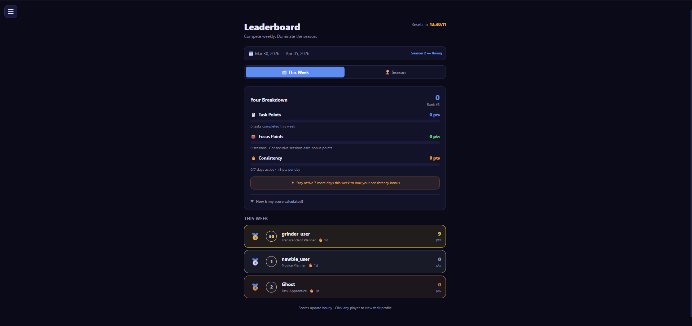
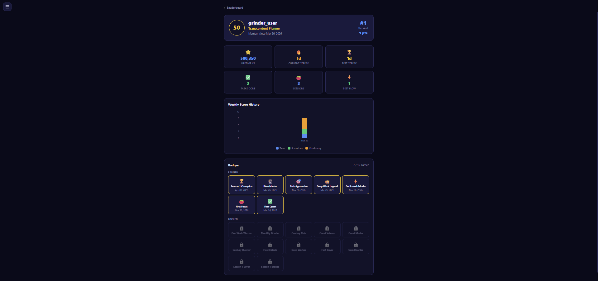
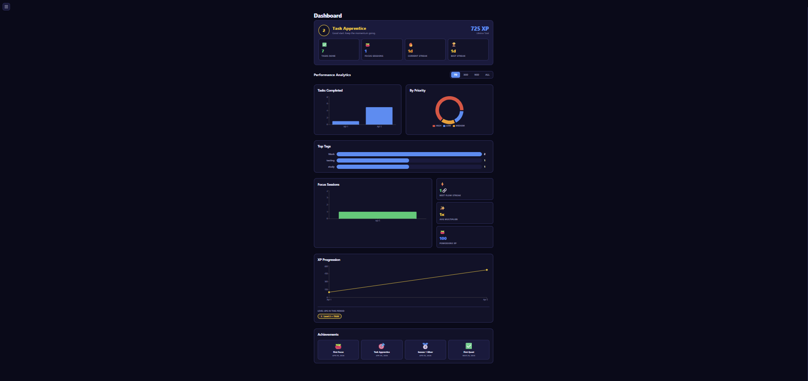
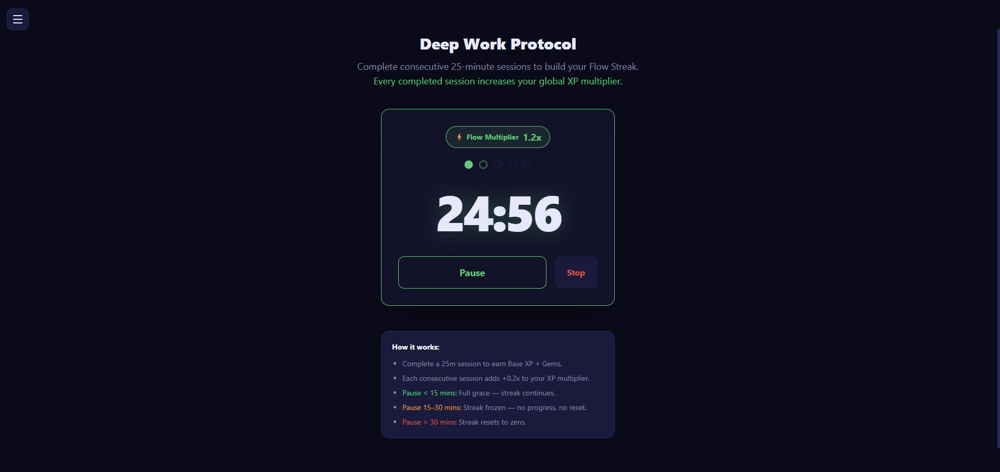
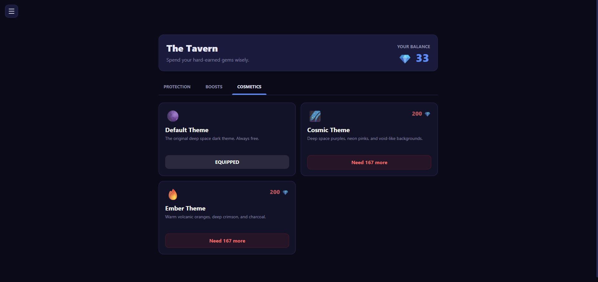

<div align="center">

#  LevelUp Tasks — Gamified Productivity App

A full-stack productivity application that applies RPG game mechanics to task management and focus sessions. Built to explore how gamification drives genuine daily habit formation rather than one-time engagement.

🔗 **[Live Demo][live-demo-link]** · 📹 **[Demo Video][demo-video-link]** · 💻 **[Frontend Repo][frontend-repo-link]**

> **Demo credentials:** `demo@LevelUpTasks.app` / `Demo123!`

</div>

---

## 🎯 What It Does

Users complete tasks and Pomodoro focus sessions to earn XP, level up, and accumulate gems. A competitive weekly leaderboard resets every Monday, rewarding consistent daily engagement over one-time bursts. Public profiles let users share their progression and badges with anyone — no account required to view.

---

## 📸 Screenshots

| 🏆 Leaderboard | 👤 Public Profile | 📊 Analytics Dashboard |
|:---:|:---:|:---:|
|  |  |  |

<br>

| 📝 Task Engine |  Pomodoro Timer |  The Tavern |
|:---:|:---:|:---:|
|  |  |  |

---

## 🏗️ Architecture Overview

### The Engine Layer — The Most Important Design Decision

The gamification math lives in three pure Java classes with zero Spring annotations and zero database access:
* **XpEngine** — XP calculation, leveling, multi-level jumps
* **StreakEngine** — Daily streak rules, freeze consumption, night owl grace
* **FlowEngine** — Pomodoro flow multiplier, pause tier evaluation

These classes are independently unit testable. Any bug in XP calculation is caught by a unit test before it ever touches the web layer. The additive multiplier formula prevents exponential reward inflation when multiple bonuses stack simultaneously.

### Two-Token JWT Authentication
* **Access token** — 15 minutes, stored in Zustand memory only
* **Refresh token** — 7 days, stored in httpOnly cookie, hashed in DB

Every refresh rotates the token. If a stolen refresh token is replayed, the backend detects the revoked token, immediately revokes ALL tokens for that user, and forces re-login. This limits the damage window of a compromised token to a single use.

### The Competitive Leaderboard

Weekly scores reset every Monday. The formula rewards consistency over volume:
`Weekly Score = Task Points + Pomodoro Points + Consistency Bonus`

* **Task Points** — HIGH=3, MEDIUM=2, LOW=1 per completed task
  * Capped at 3 HIGH, 5 MEDIUM, 10 LOW per day
  * Tasks must be 1+ hour old to score (anti-cheat)
* **Pomodoro Points** — Base 2pts per session + consecutive daily bonus
  * 4 sessions in one day = 2+3+4+5 = 14 pts
* **Consistency** — +5 pts per active day, maximum 35 pts/week
  * Showing up every day beats doing everything in one sitting

Scores are calculated on demand and cached for 1 hour. A nightly scheduler pre-calculates all user scores. 30-day seasons award permanent badges to the top 3 at season end.

---

## 🧠 Key Technical Decisions

### Why Pure Engine Classes?
Isolating gamification math from the web layer means the XP formula, streak rules, and flow multiplier are testable in milliseconds without spinning up a Spring context or database. When product requirements change — and they always do — the math changes in one place with test coverage confirming correctness.

### Why Additive Multipliers?
`XP = base × max(1, (flow - 1) + (event - 1) + 1)`
Multiplicative stacking (flow × event) creates exponential inflation. A 2x flow streak with a 1.5x XP boost gives 2.5x additively, not 3x multiplicatively. This keeps the economy balanced as users progress.

### Why Refresh Token Rotation With Reuse Detection?
A refresh token that is used once is immediately revoked. If an attacker steals and uses a refresh token before the legitimate user does, the legitimate user's next refresh attempt presents a revoked token — triggering full revocation of all sessions. The detection window is one token lifetime (7 days) rather than indefinite.

### Why Weekly Leaderboard Reset?
Lifetime leaderboards permanently lock out new users once early adopters accumulate large leads. Weekly resets give every user a fresh competitive opportunity each Monday. The consistency bonus specifically incentivizes daily return — the behavior a productivity app should drive — rather than rewarding single-session volume.

### Why Anti-Cheat Defenses in the Score Calculator?
Task points are capped per priority per day and require a minimum 1-hour age gap between creation and completion. These defenses are implemented entirely in the score calculator — no changes to task completion logic, no user-visible restrictions. Legitimate users never notice them. Score manipulation becomes pointless.

---

## ✨ Feature Set

### 💎 Gamification Economy
- Tasks award XP and gems by priority — HIGH/MEDIUM/LOW
- Pomodoro sessions award XP with flow multiplier (1.0x to 2.0x) based on consecutive sessions without excessive pausing
- 7-day streak activates 1.2x task XP multiplier
- Gem store with Streak Shield, XP Boost, and cosmetic themes
- Level-up gem bonus scales with new level — `level × 5` gems

### 📊 Analytics Dashboard
- 4 endpoints: summary, tasks, Pomodoro, progression
- WEEK / MONTH / QUARTER / ALL_TIME period selector
- XP progression combines task and Pomodoro XP by day
- Pomodoro session history with multiplier tracking
- Level-up history with trigger source (TASK or POMODORO)

### 🏅 Badge System
- 19 badges across 6 categories: Progression, Streak, Tasks, Focus, Economy, Seasonal
- Event-driven checking via BadgeContext/BadgeEvent — only conditions relevant to the current event are evaluated
- Seasonal badges awarded permanently to top 3 at season end
- Public badge shelf shows earned and locked badges with conditions

### 🏷️ Tag System
- Hover-to-delete with safety check — cannot delete tags attached to active tasks
- 15 tag limit enforced at creation
- Smart filtering — only tags from open tasks appear in picker

---

## 🚀 Running Locally

### Prerequisites
- Java 21+
- Node 18+
- MySQL 8+

### Backend
```bash
git clone [https://github.com/yourusername/LevelUp-Tasks-backend](https://github.com/yourusername/LevelUp-Tasks-backend)
cd LevelUp-Tasks-backend

# Copy and configure
cp src/main/resources/application-example.properties \
   src/main/resources/application.properties
# Fill in DB credentials and JWT secret

# Create database
mysql -u root -p -e "CREATE DATABASE task_tracker_db;"

# Start — schema creates automatically on first run
./mvnw spring-boot:run

```
### Frontend
```bash
git clone [https://github.com/yourusername/LevelUp-Tasks-frontend](https://github.com/yourusername/LevelUp-Tasks-frontend)
cd LevelUp-Tasks-frontend

cp .env.example .env
# Set VITE_API_BASE_URL=http://localhost:8080/api

npm install
npm run dev

```

---

## 📁 Project Structure

```
Task_Tracker_Backend/     # Spring Boot application
├── engine/               # Pure gamification math
├── security/             # JWT two-token auth
├── leaderboard/          # Score calculation and seasons
├── badge/                # Event-driven badge system
├── service/              # Business logic
├── controller/           # REST endpoints
├── entity/               # JPA entities
├── repository/           # Data access
└── domain/dto/           # Request and response shapes

Task_Tracker_Frontend/
└── Task_Tracker/         # React + Vite application
    ├── api/              # Axios client with interceptors
    ├── store/            # Zustand global state
    ├── components/       # Shared UI components
    ├── hooks/            # Custom React hooks
    └── pages/            # Full page components
```

---

## 🗄️ Database Schema

15 tables with composite indexes for time-series query performance:

• users — core user state and gamification fields

• tasks — task records with priority and status

• tags — tag catalog

• task_tags — many-to-many join

• refresh_tokens — hashed refresh tokens with revocation state

• pomodoro_sessions — individual session history with multipliers

• level_ups — level-up events with trigger source

• badges — badge catalog (19 badges)

• user_badges — earned badge records

• weekly_scores — cached weekly score breakdowns

• seasons — season definitions

• season_results — final season rankings

• user_themes — owned cosmetic themes

```SQL
-- All analytics queries hit this pattern
(user_id, completed_at)  -- pomodoro_sessions
(user_id, week_start_date) -- weekly_scores
(week_start_date, total_score DESC) -- leaderboard ranking

```

---

## 🌐 API Endpoints

● Auth

• POST /api/auth/register

• POST /api/auth/login

• POST /api/auth/refresh

• POST /api/auth/logout

● Tasks

• GET    /api/v1/tasks

• POST   /api/v1/tasks

• PUT    /api/v1/tasks/{id}

• DELETE /api/v1/tasks/{id}

• POST   /api/v1/tasks/{id}/complete

• GET    /api/v1/tasks/{id}/calendar

● Pomodoro

• POST /api/pomodoro/start

• POST /api/pomodoro/pause

• POST /api/pomodoro/resume

• POST /api/pomodoro/complete

• POST /api/pomodoro/forfeit

● Analytics

• GET /api/v1/analytics/summary

• GET /api/v1/analytics/tasks?period=WEEK

• GET /api/v1/analytics/pomodoro?period=WEEK

• GET /api/v1/analytics/progression?period=MONTH

● Leaderboard

• GET /api/v1/leaderboard

• GET /api/v1/leaderboard/season

• GET /api/v1/leaderboard/profile/{username}  ← public

● Store

• GET  /api/v1/store/inventory

• POST /api/v1/store/purchase

• POST /api/v1/store/equip-theme

● Badges

• GET /api/v1/badges

● Tags

• GET    /api/v1/tags

• POST   /api/v1/tags

• DELETE /api/v1/tags/{id}

---

## 💻 Tech Stack

| Layer | Technology |
|---|---|
| Language | Java 21 |
| Framework | Spring Boot 4.x |
| Security | Spring Security + JJWT 0.12.6 |
| Database | MySQL 8 + Hibernate 7 |
| Build | Maven |
| Frontend | React 18 + Vite |
| State | Zustand with selective persistence |
| Animation | Framer Motion |
| Charts | Recharts |
| HTTP | Axios with interceptors |
| Styling | Tailwind CSS + CSS custom properties |
| Audio | use-sound |

---

## 🔮 What I Would Build Next

• Redis for leaderboard caching instead of MySQL

• WebSocket for real-time leaderboard position updates

• Rate limiting on completion endpoints via Spring's @RateLimiter or a Redis-backed token bucket

• Spring Security method-level authorization with @PreAuthorize

• React Native mobile app sharing the same backend

• Velocity detection — flag accounts completing 10+ tasks in a 60-minute window for review

